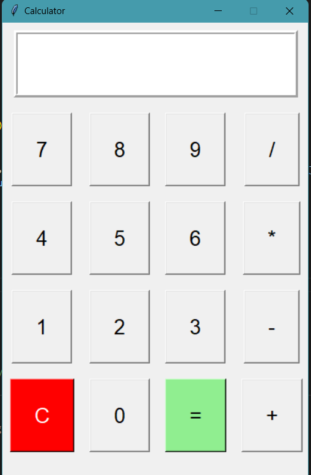

# Simple Calculator - Python Programming

**Name:** Tejas Padaki  
**Company:** CODTECH IT SOLUTIONS  
**ID:** CT08EFO  
**Domain:** PYTHON PROGRAMMING  
**Duration:** 17th Dec to 17th Jan

## Overview of the Project
This is a simple calculator created using Python and Tkinter.

The project is a simple calculator application created using Python and Tkinter. This program prompts the user to enter two numbers and choose a mathematical operation (addition, subtraction, multiplication, or division). It then performs the selected operation and displays the result.

## Task One: Simple Calculator

Create a Python program that acts as a basic calculator. It should:

- Prompt the user to enter two numbers
- Allow the user to choose an operation (addition, subtraction, multiplication, division)
- Perform the selected operation and display the result

## Objective

- To create a user-friendly graphical user interface (GUI) for a basic calculator
- To practice using Python's Tkinter library for building GUIs
- To learn about user input handling, basic arithmetic operations, and error handling in Python

## Key Activities

- Designed and developed a GUI for the calculator using Tkinter
- Implemented functionality for basic arithmetic operations: addition, subtraction, multiplication, and division
- Integrated error handling for invalid inputs
- Added a reset button to clear the input

## Technologies Used

- **Python**: Main programming language for implementing the calculator logic and GUI.
- **Tkinter**: Python's standard library for creating graphical user interfaces.

## Scope

- Basic arithmetic operations
- Easy-to-use interface
- Simple GUI design suitable for beginners and casual users

## Advantages

- Easy-to-use and intuitive interface
- Simple and quick calculations
- Error handling to prevent crashes from invalid input

## Disadvantages

- Limited to only basic arithmetic operations (addition, subtraction, multiplication, and division)
- No advanced features such as scientific operations or history tracking

## Key Insights

- Tkinter is a powerful tool for building simple GUI applications with minimal setup
- Implementing basic error handling improves the user experience significantly
- Building GUIs in Python can be a fun way to make interactive applications

## Example Output

1. **Addition**:  
   Input: `5 + 3`  
   Output: `8`

2. **Subtraction**:  
   Input: `7 - 2`  
   Output: `5`

3. **Multiplication**:  
   Input: `4 * 6`  
   Output: `24`

4. **Division**:  
   Input: `10 / 2`  
   Output: `5.0`

## Future Improvements

- Add more advanced operations like square root, power, or trigonometric functions
- Implement a memory feature to store and retrieve previous results
- Enhance the UI design for better usability and aesthetics
- Allow keyboard input for more convenience

## Code Explanation

- **Input Field**: A Tkinter entry widget that allows users to input mathematical expressions.
- **Buttons**: A grid of buttons corresponding to digits, operators, and special functions (clear, equals).
- **Operations**: The calculator evaluates the mathematical expression using the `eval()` function.
- **Error Handling**: Invalid inputs are caught using a try-except block, and an error message is shown using `messagebox`.

## Contact

For any questions or feedback, feel free to reach out to:

**Tejas Padaki**  
Company: CODTECH IT SOLUTIONS  
Email: tejaspadaki33@gmail.com
